# 使用手册

## 插件简介

本插件由OpenStageAI开发，目前发布第一个初级测试版本，支持连接C1获取参数，在C1上实时展示Blender内部预览结果，以及光场图片本地保存。由于blender的渲染引擎限制，目前渲染帧数限制在10fps。本插件的开发测试环境为Blender_4.2.1，支持Blender_3.4及以上版本。

## 插件安装

**准备工作：**

windows系统（目前暂不支持mac及linux）

Blender **3.4及以上**

blender_preview.zip插件安装包（不需解压）

**插件安装：**

打开Blender，单击左上角Edit（编辑），在弹出栏目选择Preferences（偏好设置）。

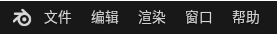

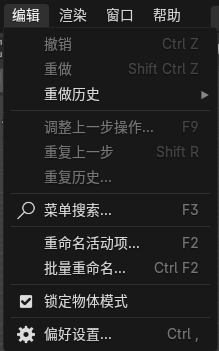

**Blender4.1及以下：**

在打开的窗口中，选择Install（安装）

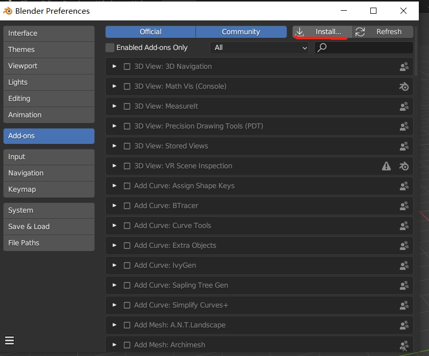

在弹出的界面选择插件安装包（zip文件不需解压），点击右下角Install Add-on（安装插件）

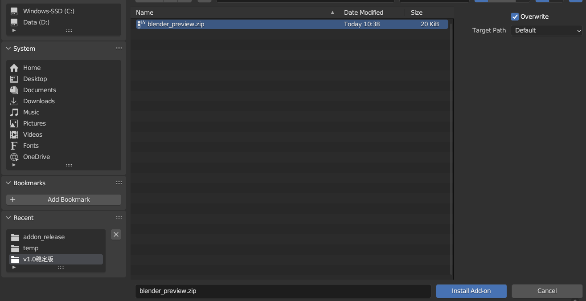

右下角提示插件安装成功，在界面中会出现3D View: blender_preview

勾选左侧方框启用插件

第一次插件启用需要在线下载一些依赖，需要连接网络，且会有一段时间的卡顿，等待安装完成即可。提示版本不匹配忽略即可。

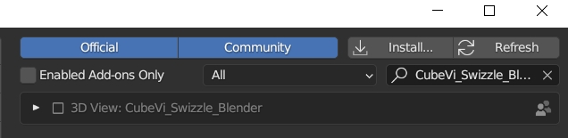

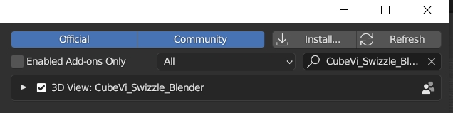

单击blender右上侧工具栏小箭头打开拓展栏，显示LFD扩展，插件安装成功。

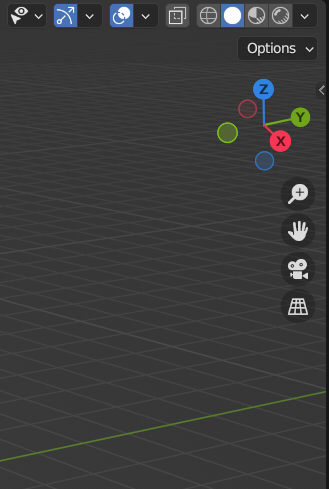 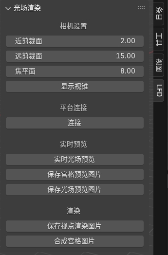

**Blender4.2及以上：**

在偏好设置的右上角小箭头中选择从磁盘安装，后续操作相同。在Blender4.2及以上插件安装后会自动启用，需要电脑联网下载依赖，会卡顿一段时间，等待安装完成即可，不需要人为点击箭头。安装完成后检查插件栏目是否有LFD一栏即可。

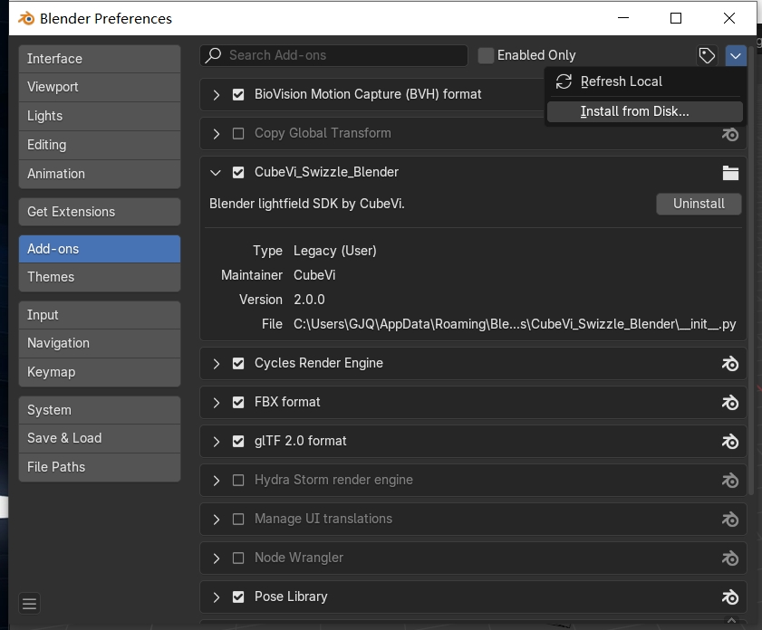

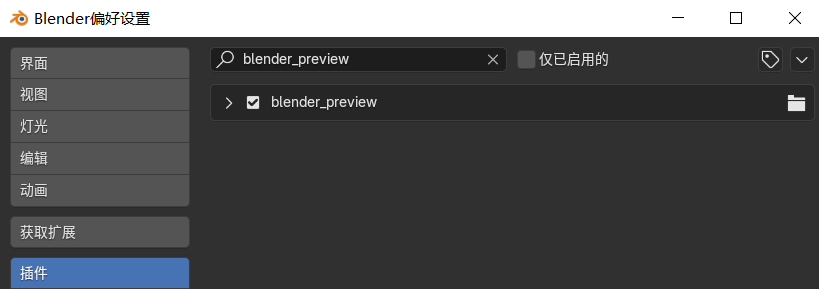

**注：插件第一次安装后，需要重启Blender方可正常使用。**

## 插件使用

**设备连接：**

连接显示器，打开OpenStageAI（需保持打开），确保可识别到设备。 

打开blender，切换到LFD插件界面。

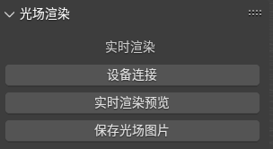

单击设备连接，下方会出现连接成功字样。

若连接失败，检查显示器是否正确显示，检查OpenStageAI软件是否识别到设备，第一次安装需要重启Blender方可正常使用。

**实时渲染预览：**

在右侧栏目中，选择”**输出”**，将分辨率设置为540\*960或1440\*2560

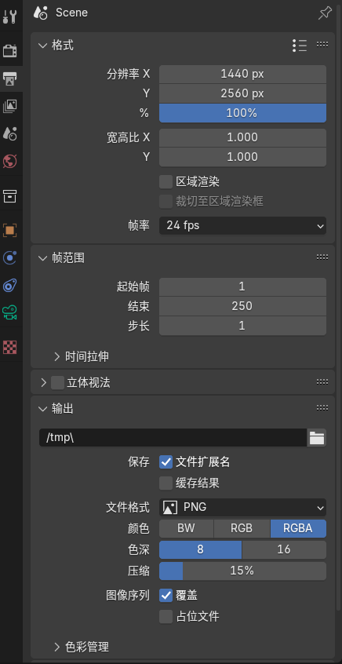

在设备成功连接后，单击实时渲染预览

在弹出的界面输入显示器的x轴分辨率，单击确定，会自动全屏显示

（取决于Windows的连接方式，假如主屏的横向分辨率为2560，C1副屏默认在主屏右边，这里就设置2560. 如果不小心显示在主屏上，需要返回blender窗口，摁Esc键取消）

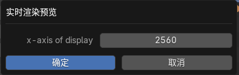

在实时渲染屏幕打开后，插件栏将被锁定，窗口将实时展示当前3D视口下活动相机的实时渲染结果。  
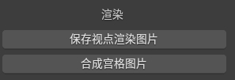

由于渲染会造成一定的性能开销，此时操作blender面板会有一定卡顿。

使用**ESC**键会自动退出实时渲染。

**保存光场图片：**

在屏幕右侧的栏目中选择**输出**，在该界面更改你想要将光场图保存的路径。

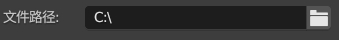

单击保存光场图片，即可保存当前活动相机的png格式图片。（目前仅支持png）

## 常见问题

Q: 我该如何退出实时预览？

A: 在Blender界面摁Esc键。

Q: 点击设备连接，显示连接失败。

A: 确保OpenStageAI打开，设备识别到。

Q: 视角里有一些黑线

A: 确保相机分辨率设置正确，由于相机渲染有时候会把自身模拟视角的黑框也拍摄进去，可以通过右上角的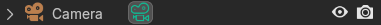隐藏摄像机让其不可见。

Q: 选项框变灰，不能点击任何功能。

A: 当前实时渲染正在进行，或者视口里没有创建任何的活动摄像机。

Q: 图像显示错屏幕/图像分辨率不正确/图像位置不正确。

A: 确保输入的显示器x轴值符合逻辑，可以在桌面右键->显示设置查看当前显示器连接模式。如果上一次全屏显示在了主屏上，下一次调整后显示在副屏上可能会出现分辨率不正确的问题，重新渲染即可。

Q: 打开实时渲染后blender变的很卡。

A: 由于blender自身的渲染引擎限制，blender中的实时预览会占用一部分计算资源，需要一定配置要求，且在这个版本中FPS被限死为10。

Q: 我保存的光场图可以分享给别人吗？

A: 由于不同的C1存在一定参数差异，同样的光场图在不同的显示器上可能会有显示差异，导致视觉错误。