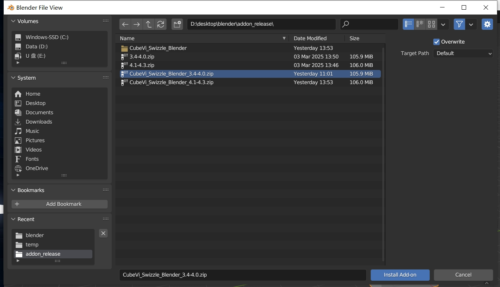
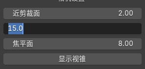
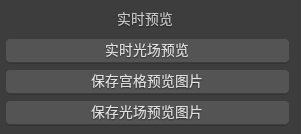
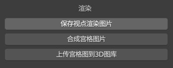

# 使用手册

## 插件简介

本插件由CubeVi开发，目前最新版本为2.0.0，支持预览，渲染图/视频的预览和保存。支持blender版本3.4-4.3. 注：由于blender4.3的API问题，该版本在预览对象的时候会出现一定的偏移，渲染功能可正常使用。

## 插件安装

**准备工作：**

windows系统

Blender **3.4及以上**

视版本下载适配3.4-4.0或4.1-4.3的插件。

CubeVi-Swizzle-Blender_3.4-4.0.zip （不需解压）

CubeVi-Swizzle-Blender_4.1-4.3.zip （不需解压）

**插件安装：**

打开Blender，单击左上角Edit（编辑），在弹出栏目选择Preferences（偏好设置）。

若安装了老版本的blender_preview插件，需要先卸载老版本插件。

**Blender4.1以下：**

在打开的窗口中，选择Install（安装）

在弹出的界面选择插件安装包（zip文件不需解压），点击右下角Install Add-on（安装插件）

右下角提示插件安装成功，在界面中会出现3D View: CubeVi-Swizzle-Blender

勾选左侧方框启用插件

单击blender右上侧工具栏小箭头打开拓展栏，显示LFD扩展，插件安装成功。

 

**Blender4.1及以上：**

在偏好设置的右上角小箭头中选择从磁盘安装，后续操作相同。在Blender4.2及以上插件安装后会自动启用。

## 插件使用

**设备连接：**

连接显示器，打开OpenStageAI并更新到最新版本2.0.1及以上（需保持打开），确保可识别到设备。 

打开blender，切换到LFD插件界面。

单击连接，下方会出现连接成功字样，相机分辨率会自动切换为默认540*960。

**相机视锥设置：**

单击远，近剪裁片，焦平面栏，可设置远，近剪裁片及焦平面数值。

单击显示视锥，会显示相机拍摄的视锥范围以及焦平面位置。

远，近剪裁面决定了相机的渲染范围。只有在远近剪裁面围成的空间内，相机才会进行渲染。

焦平面决定了相机拍摄的焦平面位置，在焦平面位置，相机拍摄的图像最清晰。在焦平面位置前后，相机拍摄的图像会逐渐变得模糊。

在焦平面靠近相机一侧的空间内，渲染出来的图片会有入屏效果。

在焦平面远离相机一侧的空间内，渲染出来的图片会有出屏效果。

在焦平面处的物体会有最清晰的显示效果。

注意：远离焦平面的物体在焦平面处的显示效果会变得较差，甚至失去3D效果。

**文件路径设置：**

单击文件夹图标，将跳转到路径选择界面，选择后续图片，视频想保存的**文件夹**。

**实时渲染预览：**

在设备成功连接后，单击实时光场预览, 插件将自动识别到C1并显示光场图。

在实时渲染屏幕打开后，插件栏将被锁定，窗口将实时展示当前3D视口下活动相机的实时渲染结果。  

由于渲染会造成一定的性能开销，此时操作blender面板会有一定卡顿。

使用**ESC**键会自动退出实时渲染。

**保存预览图片：**

在文件路径设置中，设置保存路径。

单击保存宫格/光场预览图片，即可保存当前相机下png格式图片。（目前仅支持png）

**保存并上传渲染图片：**

在文件路径设置中，设置保存路径。

单击保存视点渲染图片，即可保存40张单独的视点渲染图片。

单击合成宫格图片，即可将40张单独的视点渲染图片合成一张宫格图片。

确保平台打开，单击上传宫格图到3D图库，即可上一步生成的宫格图片上传到3D图库(宫格图最大70MB)，可从3D图库->头像->我的创作中观看。

**动画渲染及上传：**

在文件路径设置中，设置保存路径。

设置想渲染动画的开始帧-结束帧, 建议切换渲染引擎到EEVEE（Cycles渲染非常缓慢），单击渲染动画，插件会自动将选中帧范围内的每一帧宫格图渲染并保存到文件路径下。

设置想合成视频的开始帧-结束帧，设置视频的帧率，单击将宫格图序列合成为视频，插件会自动将选中帧范围内的宫格图序列按照设置的视频帧率合成为output.mp4并保存到文件路径下。

单击上传视频到平台，会将output.mp4上传至3D图库。 注：上传视频最大为70MB.

## 常见问题

Q: 我该如何退出实时预览？

A: 在Blender界面摁Esc键。

Q: 点击设备连接，显示连接失败。

A: 确保OpenStageAI打开，设备识别到。

Q: 视角里有一些黑线

A: 确保相机分辨率设置正确，由于相机预览会将场景中一些对象的辅助观测线渲染进去，可以通过右上角的隐藏让其不可见。

Q: 选项框变灰，不能点击任何功能。

A: 当前实时渲染正在进行，或者视口里没有创建任何的活动摄像机。

Q: 相机渲染出来全黑。

A: 确保直接在场景的主集合下，而非在某些子集合创建相机。

Q: 打开实时渲染后blender变的很卡。

A: 由于blender自身的渲染引擎限制，blender中的实时预览会占用较多计算资源，同时对于带纹理的渲染对象，帧率会较低。

Q: 我保存的光场图可以分享给别人吗？

A: 由于不同的光场屏存在一定参数差异，同样的光场图在不同的显示器上可能会有显示差异，导致视觉错误。可以通过分享宫格图的方式分享资源
